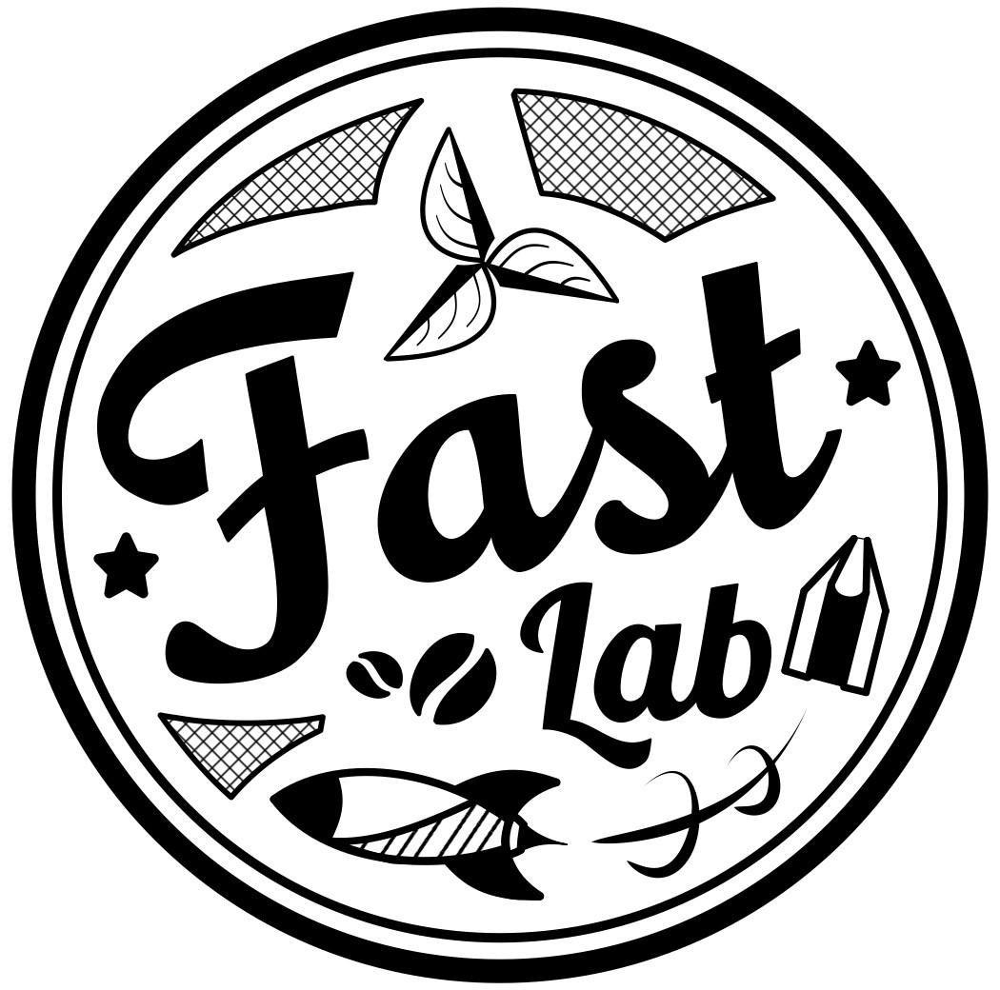

<h1>
Go with the Flow: Micro Aerial Vehicles as Lagrangian Particles in the Atmospheric Boundary Layer
</h1>
 
<table style="width: 80%; max-width: 800px; margin: 0 auto;">
    <tr>
        <td style="text-align: center; width: 100px;">
            <a href="https://natesimon.github.io/" target="_blank">Nathaniel Simon</a>
        </td>
        <td style="text-align: center; width: 100px;">
            <a href="https://www.linkedin.com/in/skywalkerli/" target="_blank">Skywalker Li</a>
        </td>
        <td style="text-align: center; width: 100px;">
            <a href="https://mae.princeton.edu/people/graduate-students/conlin-0" target="_blank">Nick Conlin</a>
        </td>
    </tr>
</table>
<table style="width: 60%; max-width: 800px; margin: 0 auto;">
    <tr>
        <td style="text-align: center; width: 100px;">
            <a href="https://sites.google.com/view/njwei" target="_blank">Nathan Wei</a>
        </td>
        <td style="text-align: center; width: 100px;">
            <a href="https://www.girguissedky.com/" target="_blank">Girguis Sedky</a>
        </td>
    </tr>
    <tr>
        <td style="text-align: center; width: 100px;">
            <a href="https://irom-lab.princeton.edu/majumdar/" target="_blank">Anirudha Majumdar</a>
        </td>
        <td style="text-align: center; width: 100px;">
            <a href="https://mae.princeton.edu/people/faculty/hultmark" target="_blank">Marcus Hultmark</a>
        </td>
    </tr>
    <tr>
    <td align=center width=40px>

        

    </td>
    <td align=center width=40px>

        

    </td>
    </tr>
</table>

<a href="https://robo.princeton.edu/" target="_blank">Princeton University</a>

 
<table style="width: 80%; max-width: 800px; margin: 0 auto;">
    <tr>
        <td style="text-align: center; width: 50%;">
            
        </td>
        <td style="width: 50%;">
            

                <b>To appear:</b> <a href="https://meetings.aps.org/Meeting/DFD23/Session/J21.9">APS DFD 2023</a>.
            

        </td>
    </tr>
</table>
 

<b>Abstract:</b> Conventional particle velocimetry techniques are restricted to measurement volumes on the centimeter scale; recent tracking algorithm and tracer particle advances increase domain sizes into the meter range, but to reach hundreds or thousands of meters alternative methods are required. The authors propose LaDrone, a particle velocimetry technique based on 40 gram Micro Aerial Vehicles (MAVs). Tasked only to compensate for gravity, LaDrones move freely due to the wind force in three dimensions. They can be tracked at centimeter-level precision through RTK GPS, collecting atmospheric boundary layer data as they are swept by the wind. Such data could be used to analyze the atmosphere at the kilometer scale. 

 

    

    

